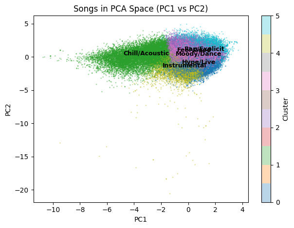
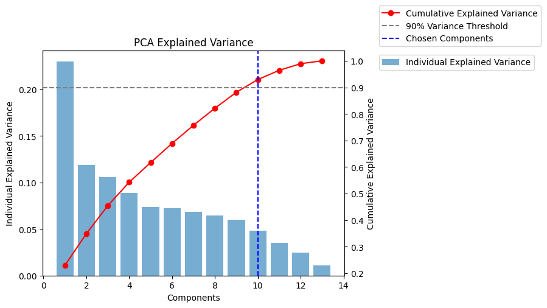
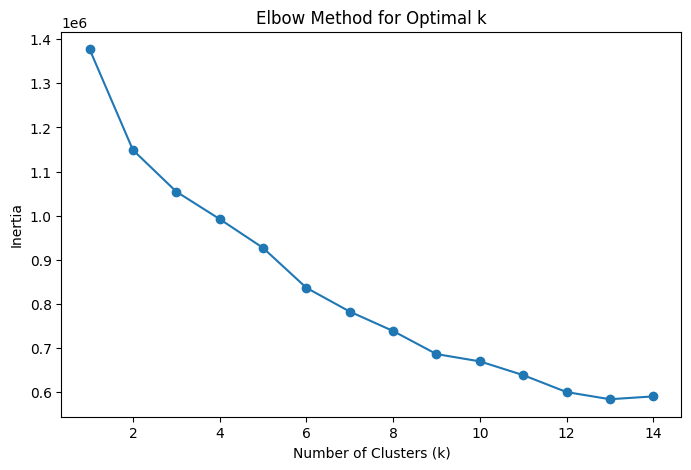

# Spotify Music Clustering

A DS 3000 (Foundations of Data Science) mini-project at Northeastern University by Dylan McCormick and Ali Salha.

**Question:** Are there a small number of underlying, generalized "types" of songs that go beyond genre?

**Short answer:** Yes. Clustering songs on their audio features alone, without looking at genre, gives six distinct groups.

📄 **Full write-up:** [report.pdf](report.pdf) (LaTeX source in [report.tex](report.tex))



## Data

We used the [Spotify Tracks Dataset](https://www.kaggle.com/datasets/maharshipandya/-spotify-tracks-dataset) from Kaggle, which has roughly 90,000 unique songs and their Spotify audio features. The notebook downloads it automatically with `kagglehub`.

We clustered on these 13 features:

`danceability`, `energy`, `loudness`, `tempo`, `valence`, `acousticness`, `instrumentalness`, `speechiness`, `liveness`, `duration_ms`, `mode`, `time_signature`, `explicit`

`explicit` was converted from a boolean to `0`/`1`. `track_genre` was left out on purpose, so it is only used afterwards to sanity-check the clusters.

## Method

1. **Standardization:** z-score every feature with `StandardScaler`.
2. **PCA:** keep the first 10 principal components, which explain about 90% of the variance. We also computed the covariance matrix and eigendecomposition by hand with NumPy to check the result against scikit-learn.
3. **K-Means:** use the elbow method on inertia (WCSS) for k = 1 to 14, which points to **k = 6**, then fit K-Means on the PCA-reduced data.
4. **Interpretation:** compare each cluster's mean feature values and sample tracks to give it a name.

| Explained variance | Elbow method |
| :---: | :---: |
|  |  |

## Results

| Cluster | Label | Defining traits |
| :---: | --- | --- |
| 0 | **Hype/Live** | High energy, loudest, fastest tempo, highest liveness |
| 1 | **Chill/Acoustic** | Low energy, quietest, slowest, most acoustic |
| 2 | **Feel-Good** | Most danceable, high valence, all major key |
| 3 | **Moody/Dance** | Like Feel-Good, but all minor key |
| 4 | **Instrumental** | Very high instrumentalness, longest tracks |
| 5 | **Rap/Explicit** | ~97% explicit, highest speechiness |

Each cluster cuts across several genres. For example, Hype/Live mixes rock, pop and hip-hop tracks that share a high-energy, loud, fast profile. The full table of per-cluster means and the discussion are in the [report](report.pdf).

## Running it

```bash
pip install numpy pandas scikit-learn matplotlib kagglehub jupyter
jupyter notebook analysis.ipynb
```

The notebook downloads the dataset on first run (you may need [Kaggle credentials](https://github.com/Kaggle/kagglehub#authenticate) set up).

## Repository layout

```
├── analysis.ipynb      # analysis notebook (data loading, PCA, K-Means, plots)
├── report.tex   # LaTeX source for the report
├── report.pdf   # compiled report
└── images/      # figures used in the report and this README
```
